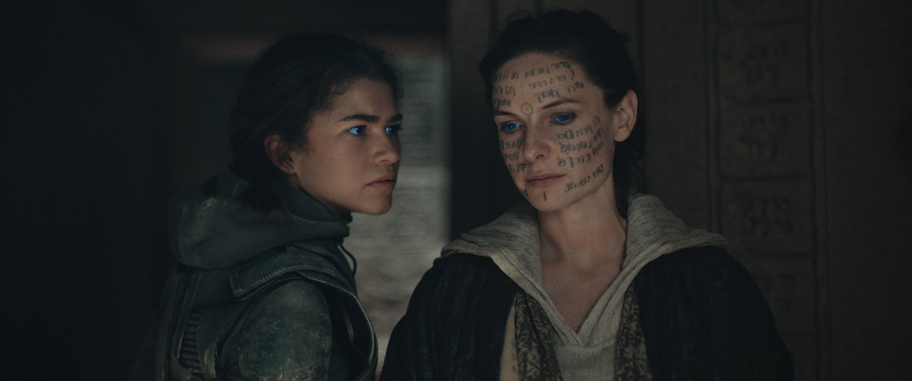

### I. Introduction
Lately, AI has become the enemy of modern education. As early as last semester, every class syllabus I’ve received came with some kind of warning to not use AI in any way, shape or form. In many ways, it can be abused by students as a means to cut corners in class. To combat this, some educators have been using AI themselves. AI detectors like Turnitin have often used to check students’ work for use of AI or plagiarism. However, the accuracy of such detectors has been called into question, as multiple incidents arose of students being accused of cheating for having essays flagged for high levels plagiarism/AI usage, when in reality, the essays were written honestly.

In comparison to my other classes, which prohibit any use of AI, ICS 314 is the only class I’ve ever had that actually encourages students to use it. I’ve used ChatGpt occasionally to look up simple code syntax that I forgot (e.g. “how to change the background color in css”) or for coding examples. Although my use of it has been very limited, I found it helpful when I needed simple questions answered fast.

### II. Personal Experience with AI:
I have used AI in class this semester in the following areas:

1. Experience WODs e.g. E18 
    I don’t remember for which experiences specifically, but I used ChatGPT for module 10(HTML, CSS). This module introduced a lot of new syntax and it was hard to remember all of it, so I asked it simple things like “how to write a comment in HTML,” “what is hr,” “how to change the color of text.” I also asked it to explain the difference was between margins and borders and it answered with a visual representation, which was very helpful in understanding the concept.
   I also used it in module 11, specifically for E36: Your Choice with Bootstrap 5. There were many times when I wanted to format elements a certain way, so I would ask ChatGPT how (e.g. how to make navbar align right?). Often times the answer it gave did work, but sometimes it didn’t, and I would go back to Google and stackOverflow.

2. In-class Practice WODs 
   I did not use AI but I did utilize Google or StackOverflow if I had a question. I had more trust in these sources because the information was coming from an established reference or real people online. I was most concerned with getting the most accurate answer first and avoiding wasting time trying to fix a potentially bad solution.  
3. In-class WODs 
   I did not use AI, for similar reasons. I was more worried because I didn’t want to mess anything up during the WOD. I would mostly reference my old code if I forgot how to code something. 
4. Essays 
   I’ve never used AI on an essay. The professors put a lot of emphasis on using your own 'voice,' so I've never asked it to write any part of an essay. I've never used it as a grammar or spell-checker either, but I definitely will from now on. I think that's a great way to utilize AI. 
5. Final project 
   I’ve haven’t used AI on the final project. Most of the work has been doable without it, since most it has been similar to digits, in which I’m just reworking the template and adjusting the css. For things I didn’t know how to do, like implementing a search bar, I used a YouTube tutorial and not AI. I didn’t think to use AI at the time, but as I’m writing this I just looked up how to do it in ChatGPT, and it gave me about the same thing the YouTube tutorial did, so I probably could’ve used AI and saved some time. 
6. Learning a concept / tutorial 
   I’ve asked ChatGPT to explain things like <form> in HTML and card in bootstrap. It provided example code and explanations of the different components, which I found helpful.
7. Answering a question in class or in Discord 
   I’ve never used AI to help answer a question because their questions were very specific and required you to actually look at their code/files in order to help. For example, someone asked, “While I was deleting files, all of a sudden my local page went white. Why is this happening?” This is not the kind of problem AI can diagnose, so I didn’t use it here.
8. Asking or answering a smart-question 
   For similar reasons as #7 I didn’t use AI here either.
9. Coding example e.g. “give an example of using Underscore .pluck” 
   I have used AI for coding examples of things like bootstrap cards and navbar, because they have such specific formatting that it’s hard to remember off-hand. ChatGPT gave a example and explained each of the components, which was very helpful.
10. Explaining code 
    I’ve used AI to explain things I didn’t understand like “gx-3” or hr. It provided an explanation and example code, which was very helpful. Using AI in this case would've been quicker than scrolling through a website looking for the answer
11. Writing code 
    I’ve never asked it to write code for me, only examples of concept I was attempting to create. I mainly used it to understand concepts I didn't understand or see how certain elements were formatted, like the navbar or card element. 
12. Documenting code 
    I’ve never used AI here because I felt like I could maintain good code documentation without it.
13. Quality assurance 
    I haven’t used AI here. If I had trouble with code, I would look for a solution on stackOverflow.
14. Other uses in ICS 314 not listed above 
    None.

### III. Impact on Learning and Understanding:
I believe that overall, AI has helped enhance my learning of software engineering concepts. I've found that it's primary benefit is its efficiency. As opposed to sifting through multiple websites or scrubbing through YouTube videos looking for the answers, AI applications like ChatGPT automatically provide the answer with a comprehensive explanation of the concept and a handy example. A potential five-minute-long Google search or Youtube video summed up in just a few seconds. 

### IV. Practical Applications:
AI has found much usage in a variety of applications outside of ICS 314 and even outside of software engineering in general. One application is the world of visual effects of VFX. Back in 2011, the massively popular tv-show Game of Thrones aired it's first season, introducing one of it's most iconic characters, Daenerys Targaryen. In A Song of Ice and Fire, the book series the show is based on, all Targaryens have the signature characteristics of white hair and purple eyes. However, while the TV-Targaryens sport their stunning platinum blonde hair, the iconic purple eyes of their book-counterparts never made it to the big-screen. According to the creators, CGI at the time was too complicated and expensive, while violet contacts were very uncomfortable for the actors to wear, which subsequently hindered their performance. Ultimately, VFX limitations prevented some of these iconic details from the books from making it on-screen. 

    

Fast forward 12-ish years to when the movie Dune Part Two was being created. In the world of Dune, there exists a group of people called the Fremen, who have characteristic blue eyes. Due to the large amount of Fremen characters, the work to digitally color all of their eyes would have been difficult, but the special effects team found a clever solution. VFX supervisor Paul Lambert stated in the official production notes:

>We came up with a different technique, using what we’d learned before from the hundreds of blue eye shots in the first movie and creating a machine learning model, an algorithm trained from those ‘Dune’ shots to find human eyes in an image, which would then give us a matte for the different parts of the eye. We then used this multi-part matte to tint the eyes blue. Some worked better than others, those others we did by hand. It actually went full circle sometimes, in that we had to take out some of the blue eyes that got generated in the non-Freman characters, rather than add them, as the algorithm would just find eyes, whether they were Freman, Harkonnen or Sardaukar! But, it was a brand new technique, getting that done.

    

In other words, instead of having a VFX artist identify the eyes frame by frame, the VFX team utilized AI to find the eyes instead. As Lambert stated, the algorithm was not perfect and required artists to adjust or undo some of it's work, but it ultimately cut down many hours of what otherwise would've been very tedious work. In this instance, AI helped make a task that ten years ago would've been very complicated, expensive and tedious, a feasible job. This highlights one of the great upsides of AI, in that it can automate the menial and tedious tasks, allowing the user to focus on more complex work. This advantage applies to software engineering as well, as AI can be used to write starter code, write tests and test cases, do error checking, etc. Similar to the eye tracking algorithm used in Dune, such uses of AI are imperfect and require review, but ultimately can save a programmer hours of menial work. 

### V. Challenges and Opportunities:
One of the challenges of using AI is, as stated previously, it is an imperfect tool. At times, its answers may be incorrect or may not provide the right solution for one's specific problem. The user needs to have a basic understanding of the concepts they're using in order to use AI effectively. Blindly throwing in whatever ChatGPT spits out might work some of the times, but overall, is largely ineffective. A user should be able to understand what the solution is doing and be able to implement and adjust it as needed for their own unique code. Otherwise, the problem could be made worse or could cause bugs that create an even bigger issue in the future. 

### VI. Comparative Analysis:
Two CS classes I took with considerably different teaching methods were this class, ICS 314, and ICS 212, a class that mainly focused on the C programming language. ICS 212 was taught more traditionally with in-class lectures, textbook readings and coding assignments that were to be completed without the help of the internet or other classmates. AI wasn't mentioned, maybe it wasn't a concern yet, but I'm fairly certain they wouldn't allow that either. ICS 314 however, encouraged students to use AI freely. Between the two, I was more engaged in my 212 classes because there was almost no other good source of information outside of lecture, as we were not allowed to use the internet or work with classmates to solve the coding assignments. Additionally, the homework assignments were tailor-made by the instructor, so you could not just look up the answer online or ask a friend. You needed to have a strong understanding of the concepts in order to complete them. The 212 class demanded students to be fully engaged in class and make a strong effort to understand the concepts, otherwise they would not succeed. 314 however, was not quite as demanding. The course allowed free-range use of the internet and AI in all assignments and tests (WODs). Although I would invariably run into roadblocks, for most cases I could rest easy knowing that the solution was only a click away, either from ChatGPT, StackExchange or a friend on Discord, and not from my own head. This meant for me, I didn't have to try as hard and think as hard. I didn't have to lament over a solution like in 212--scanning the textbook for the second time, looking over my notes, going in to office hours. AI-enhanced classes can make learning easier, but in some cases can negate the need for critical thinking and problem solving. Moreover, I've retained the knowledge and skills I learned in 212 better in 314. Looking back at my old C code, I still understand what every single line of code is doing. The skills I've learned in this class--Javascript, Bootstrap 5, React, etc.--I feel haven't stuck as strongly, as I always had a reference by my side, it being AI or Google. Looking back at my experiences in these two classes, I felt I had a better learning experience in the class without AI or any internet resources.  

### VII. Future Considerations:
I believe AI can be an immensely helpful tool in the realm of software engineering education. It can teach students simple concepts, be used as a quick reference, and potentially identify problems in their code. It shines best when it helps the user reduce time spent on petty tasks (e.g. looking up the syntax of something of that one css element you forgot). However, some challenges arise when AI is misused or abused. When it's used simply as an answer machine and students are not actually learning or understanding the code, then it becomes problematic. However, AI is here now and there is not a soul on Earth who can stop people from using it. Therefore, I think students should be taught how to use AI responsibly. Before inputting ChatGPT's solution into their code, they should try and understand what the code is doing, and if it will actually work for their code. AI will be wrong sometimes, so students need to have some sense on what will work or not. It's like the fact that doctors still Google things from time to time. They don't throw the symptoms into Google and diagnose you with the first thing that comes up. No, they combine the results from their query with their many years of medical experience and intimate understanding of the human body, along with the details they know about their patient to come to an informed diagnosis. The same applies to coding. You can't create a proper solution if you don't understand the body(coding concepts). Such AI engines can be great in helping students more efficiently, but it can't be used as a crutch. 

### VIII. Conclusion:
Overall, I think AI can be a very helpful tool when used effectively. It's excellent for automating the menial tasks of a project, which can save a programmer a lot of time, as well as providing quick answers to simple questions. Some problems arise when AI starts being used as a crutch. Blindly using it's output, without taking the time to understand what the code is doing, is one of the ways it can be misused. In the classroom, while it can be very helpful to students, the ease at which it provides answers may end up detracting from students' learning, rather than enhancing it. Therefore, I think students should be taught how to use it effectively and to not treat it like a Magic 8 Ball. With this, AI can be an immensely helpful tool to students, helping them learn more efficiently and effectively. 