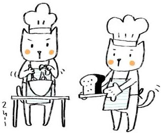

## "What do you want to be when you grow up?" 
As a kid my answer was always, "a baker." I don't really know how my 8 year-old-self decided on becoming a pastry-maker; I think I was imagining it involving some Willy Wonka-levels of incredible sweets creation or maybe just the idea of being able to snack on yummy pastries all day made it the most appealing. I definitely did not imagine myself being here, pursuing a degree in computer science, and eventually a career working on code and computers. While I don't have a strong passion for baking or coding, I like them well enough that I could work a job doing one and save the other as a hobby for when I want a sweet treat. 

So far I'm most interested in web/app development and game design. There have been times when I wanted to create some kind of application or website for something but didn't know how. For example, when I was working at the chemistry stockroom, I thought it would be great if we had an online website to manage our inventory. All items could have pictures and more in depth descriptions, as well as a better search function and a way to filter through items. I also thought it would be so cool if we had an online ordering service (like Target!) where someone could order the items they wanted online and the clerk (me) would gather everything and deliver it to them or have them pick it up. It would definitely save them a lot of time and would give me something to do. I'm interested in creating applications/websites like this for practical use, but my skills are very limited at the moment.

This brings me to the skills and experiences I'm hoping to gain in the future. I'd like to learn how to create small apps and games. To do this it'd be best to pick up more programming languages like Python and HTML. 
