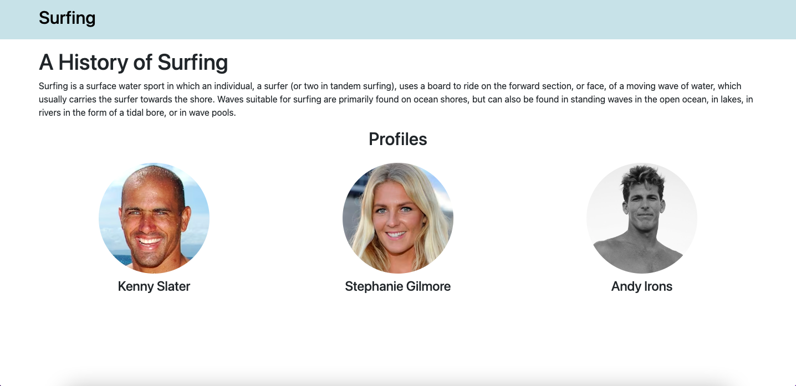
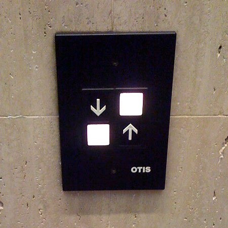
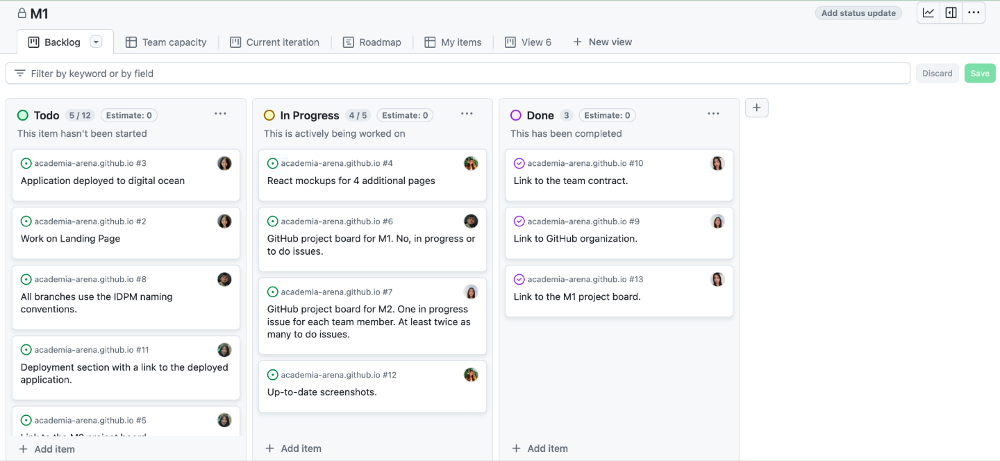

### It's the Little Things
A good user interface is vital for any website or application. It's the very first thing that the user sees and interacts with, so for the same reason you'd only wear business casual to a job interview, making a good impression is everything. But what exactly makes a UI 'good'? Let's first take a look at these two examples: 

At first glance it's clear which design gives a better impression. The one on the left is messy and hard to read. The background does not provide enough contrast against the text, making some words completely indiscernible. The profile names and images are misaligned with overall very poor formatting. The overall impression this first example gives is disorganized and unprofessional. The second one, on the other hand, is much easier on the eyes. It's clean, organized and easy-to-read, with all elements of the page formatted nicely and evenly. This page says ,"organized and professional." Having a good presentation is paramount for any user-interface, and these examples show what a difference it makes.

Another consideration of a good UI is functionality. A website that's hard to navigate is just as bad as an ugly website. Confusing layout, improperly named links, and no navigation bar are some of the hallmarks of bad UI design. If it takes a user more than 10 seconds to find the login, then maybe it's time to rethink the design. Here's an absolutely hilarious website with intentionally bad UI design: [User Inyerface](https://userinyerface.com/game.html). 

Learning how to create good design like this was the focus of the User Interface Frameworks modules. A UI Framework is a collection of classes and interfaces that create a structure for designing user interfaces. In class, we began creating websites with raw HTML and CSS, seen in the first 'History of Surfing' example, and then learned how to utilize UI Frameworks like React to create properly designed websites, as seen in the second example. While making good websites is a great skill to have, learning the importance of good design goes beyound just web design. Good design is important in everyday life, not just a website. Think of all the products you use on a daily basis-phone, toaster oven, TV remote. Good design is critical to make a product appealing and useful to the everyday user. Like imagine giving people an aneurysm everytime they want to ride the elevator: 

Aside from functionality, appearance is also important in good design. Think of all the signs and billboards you drive past on your way to work/school. Advertisements like this need to clear, concise, eye-catching. Especially if the advertisement is for a business, how they present themselves speaks volumes to their professionalism and trustworthiness. The importance of good UI design that we learned goes beyond just creating websites. It's something that we need in everyday life. 

### Teamwork Makes the Dream Work
Collaboration occurs everywhere and in almost any occupation. Being able to work efficiently with others is one of the most important skills in life. There are many tools and strategies out there to help people achieve this. One of them is called Issue Driven Project Management (IDPM), an agile project management strategy designed to help large teams of developers create high-quality apps with larger code bases (500k lines of code). A quick breakdown of the IDPM process is this: all tasks for the project are created as issues in GitHub projects, called 'Milestones'. These tasks are divided into categories of to-do, in-progress, and done. There should be twice the number of tasks as there are group members and every group member should be assigned an issue that's in-progress. Every task shouldn't take more than three days to complete (otherwise is should be broken into smaller tasks) and each has a description on what needs to be completed and in which branch this work should be completed in. After a certain amount of time has passed or a significant portion of the project has been completed, the to-do and in-progress issues are moved over to a new milestone and the finished issues are preserved in the current milestone as a reflection of what was completed during that period of time. During this time the team also meets twice a week to discuss the project and any issues that arise. This continues until the project is completed. Here's an example (there were 6 members of our team here, but I didn't get a screenshot of our milestone when it was formatted properly so just pretend there are 12 to-do issues and 6 in-progress ones):

This method of project management is quite efficient and helps mitigate confusion between team members. Any member can clearly see what everyone else is working on at any time, so there's no complication over who's doing what. Additionally, once a team member finishes their task, they can immediately pick a new one and start working without having to ask or discuss with their team first. Having, basically a to-do list, laid out for you makes work run smoothly and efficiently. We were required to utilize this in our group project and I found it very helpful. I would want to apply this style of project management to ANY large project I work on in the future, not just coding-related ones. It offers a clear path to the finish line with every step laid out nicely so that everyone can reach the goal together with ease. 