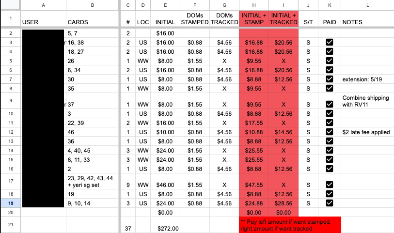

All K-pop albums of the current generation come with randomized photocards of a member of the group.
Thus, a large community of collectors formed for the purpose of trading, selling, or buying these cards,
so that everyone can build their collections more easily. 

An example of what a typical K-pop album looks like. It typically includes a CD, photobook and randomized photocard(s). 

A group order manager (GOM) is a person who buys albums, photocards, or other merchandise in bulk and distributes them in smaller quantities to various joiners. This is usually done because buying in bulk is cheaper, it reduces individual shipping costs and a joiner may have a better chance of getting the member photocard they want if there's a larger pool of albums (the albums are opened and sorted based on who wants which member).

The general process is:
  1) Gather interested joiners (through an instagram post)  
  2) Order the items  
  3) Collect payments and mailing information   
  4) Sort, package and mail to all joiners   

A GOM must be organized and have good communication skills in order for the group order to go smoothly. I organize everything into a spreadsheet, which helps me keep track of all my joiners, what item(s) they want, how much they owe (including shipping + other fees), whether they have paid, and their mailing addresses. Clear and concise communication is key when it comes to hosting a group order so that everyone clearly knows when to pay, how much they owe, and how to submit said payment and mailing information to me. The GOM is also the middleman between the buyers and seller, so it's important to consistently provide shipping updates as the process can be lengthy. I also have to handle any issues that may arise such as problems with customs, joiners having trouble making payments, etc. The most time-consuming part is sorting and packaging everyone's orders individually. Another reason to be organized is that you don't want to send items to the wrong person. 

One the spreadsheets I've created in the past:

Another important thing a GOM must have is trust within the community. All trading and selling is done on an honor basis, so there is very little you can do if you get scammed. That's why it's important to build a good reputation through positive past transactions and good conduct as a GOM. If people see that you're trustworthy, organized, and a good communicator, they will come back again!

Being GOM takes a lot of time and effort, but being able to help others build their collections and forming new relationships with fellow collectors makes it 10000% worth it!
