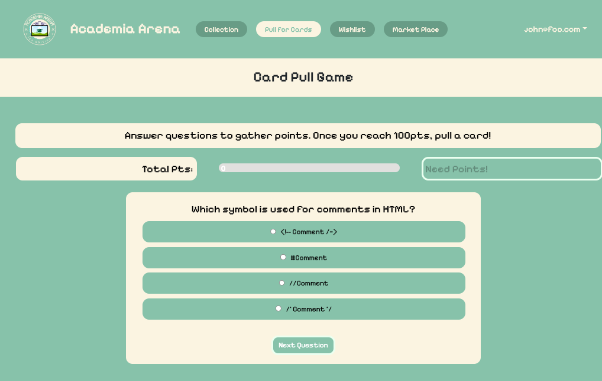
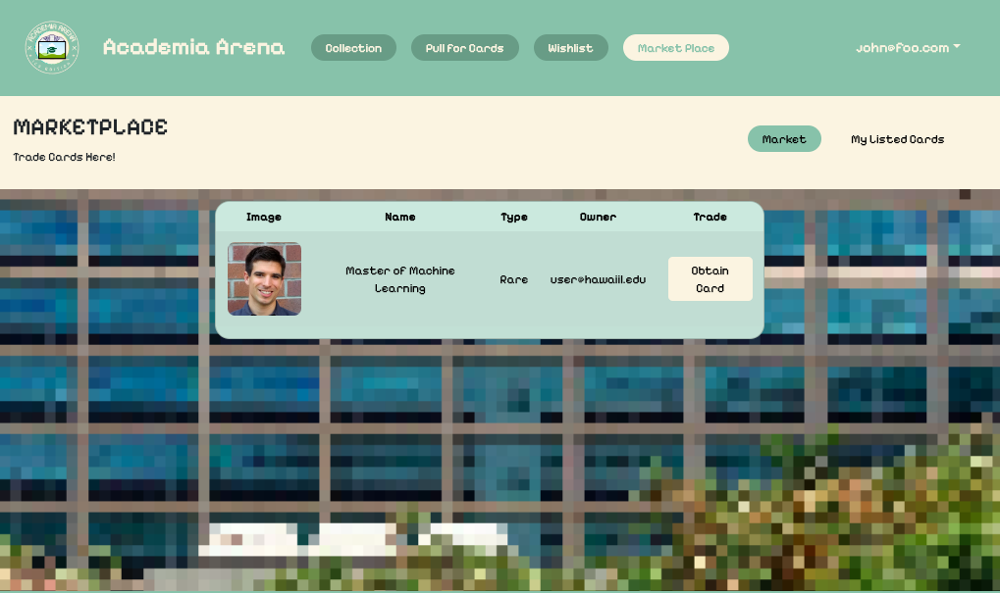
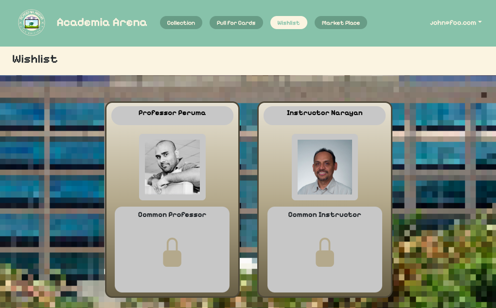
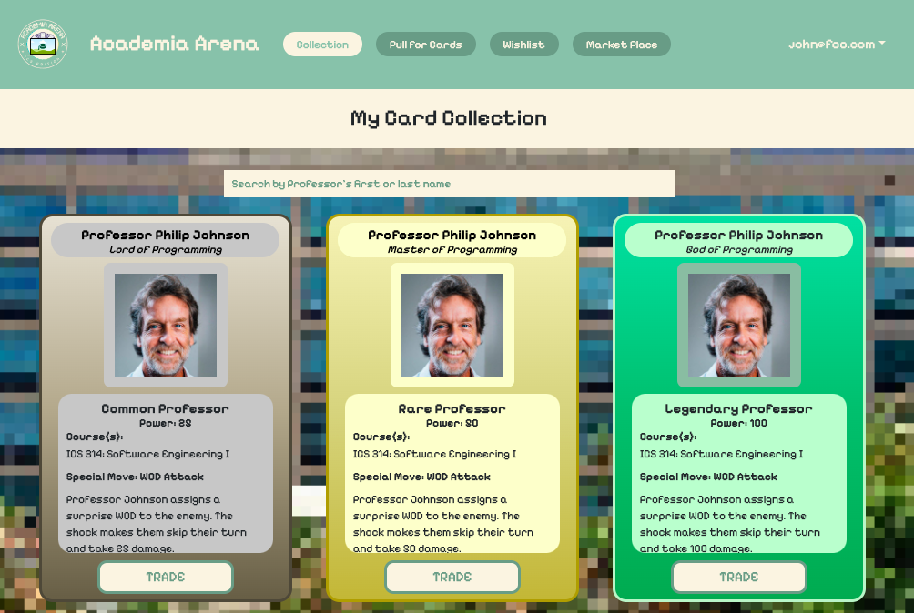
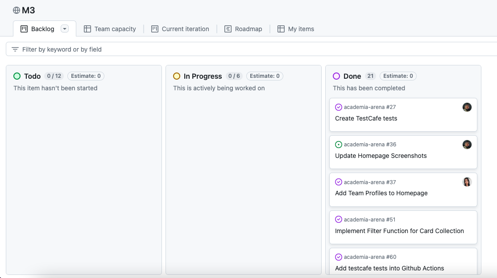

### Academia-Arena: A Professor Trading Card Game
For the final group project of my ICS 314 class, my groupmates and I created a website called Academia Arena. This site hosts a trading card game in which users can collect and trade playing cards of the ICS professors at UH Manoa. My fellow team members were Erin Patterson, Elsa Wong, Yu Fang Ma, Carlo Viloria and Michaella Villanueva. 

The website allows players to:
* Create an account
* View the cards they've collected
* Create a wishlist of cards they'd like to collect
* Obtain new cards by answering a series of computer science-related questions
* List their cards in a marketplace so that other users may trade with them

Each card contains the professor's name, the class(es) they teach and a fun fact about them. The goal of the website is to help students learn more about their professors and encourage more interaction between CS students and their professors. 

Some of our pages:
Card Pull Page (created by Michaella)
<p align="center">

</p>

Marketplace Page (created by Erin)
<p align="center">

</p>

Wishlist Page (created by Elsa)
<p align="center">

</p>

#### My Contributions
<p align="center">

</p>
For this project I was responsible for creating the Card Collection page, which lists all the cards that the user owns. This page reads from a database that holds all the cards that all users own, but only displays the ones that the current logged-in user owns. 

One of the trickier steps of building this page was making the styling (color) differ depending on the card's rarity. Initially, we achieved this by creating three separate card components for the three rarities and used an if/else statement to check the rarity and call the corresponding component. While this solution did work, it was not the most efficient, as every time we needed to edit the card component, we would have to edit three separate components.
Instead, I was able to make this work with one card component by passing the css id names (e.g. commonBackground, commonImage...) directly to the card component depending on the rarity. Then the card component would use the passed name as the id name (e.g. id={background}). This allowed us to use one card component and change the styling depending on card rarity. 

```
filteredCards.map((tcard) => {
    if (tcard.type === 'Common') return <Col><ThisCard key={tcard._id} card={tcard} background={commonBackground} title={commonTitle} image={commonImage} text={commonText} onTradeClick={handleTradeClick} /></Col>;
    if (tcard.type === 'Rare') return <Col><ThisCard key={tcard._id} card={tcard} background={rareBackground} title={rareTitle} image={rareImage} text={rareText} onTradeClick={handleTradeClick} /></Col>;
    return <Col><ThisCard key={tcard._id} card={tcard} background={legendaryBackground} title={legendaryTitle} image={legendaryImage} text={legendaryText} onTradeClick={handleTradeClick} /></Col>;
              })
```
I also implemented a search bar that finds cards by first or last name and added most of the professor information. 


#### My Takeaways from This Experience
This was the first coding assignment I've done with a group, and it has taught me a lot about collaboration and effective teamwork in programming-related projects. Like any group project, communication is vital. We always made sure to let each other know when we were making a major commit to the project or if we were having any bugs or problems. It was imperative that we relay what were doing or changing, especially if it involved  another team member's code. 
Moreover, for this final assignment we utilized a very powerful group management strategy called Issue Driven Project Management, which helped us stay organized and on-track. It's essentially a project page that lists all the issues or tasks that need to be completed. The page contains three categories that define a issue's status: To-do, In-Progress, and Done. 

One of our project management pages: 
<p align="center">

</p>

I found this method of project management incredibly effective because it allowed us to work independently while staying on track. All team members can see clearly what everyone else is working on, so once they complete a task they can simply assign themselves another one. Or if I see my teammate working on X, I'll know not to touch Y since it's closely related to X. This eliminates some of the hassle of division-of-labor and keeps the project moving. We of course still had weekly meetings and talked over discord regularly, but this method allowed us to work more efficiently and independently. I think this project management strategy was one of the best takeaways from this class in general, and is something I'd like to use for all projects moving forward, not just CS-related ones. 